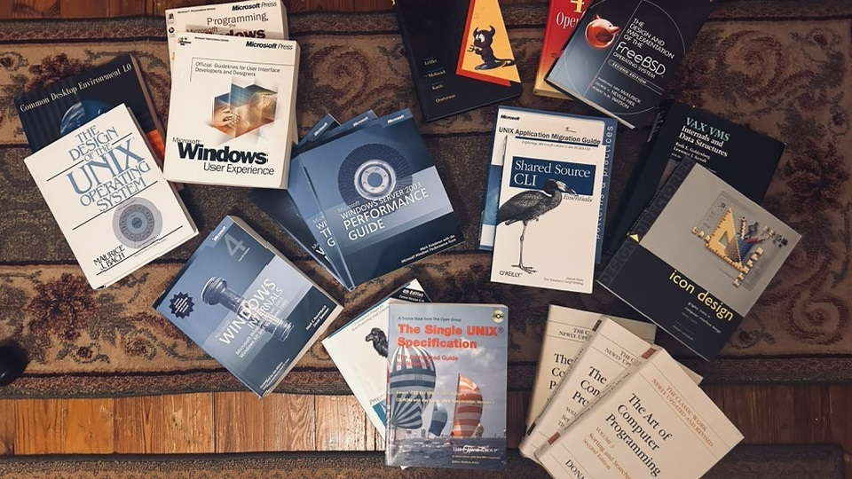



  
<h2>Jonathan David Allen Moore</h2>

jonathanmoore@computer.org | jonathanmoore@sphinxlogic.onmicrosoft.com | https://sphinxlogic.visualstudio.com | Reston, Va, US | +1 276-696-1163

<h2>PROFESSIONAL SUMMARY</h2>

I'm a 47-year-old Royal Society of the Arts Fellow, I was awarded my fellowship after I helped discover the Higgs Boson at CERN with BOINC or Berkeley Open Infostructure in 2012 with many others. In 2001 I helped work on the Macromedia Flash site for the movie Artificial Intelligence for Steven Spielberg and the movie Finding Nemo. Macromedia now in the Computer History Museum. I support CEO Mathew Taylor not Andy Haldane. I was interviewed in 2025 for RSA CEO in London. In 2018 I went #1 in Ireland on Reverbnation and Billboard Magazine in Ambient Music for 8 weeks straight. In 2001 I was featured on CNN's by Aaron Brown at Macromedia as a Child Celebrity. I was mailed a Harvard University Social Sciences Application my Microsoft David Cutler. I'm suing McClure Racing for the Book. <a href="https://www.amazon.com/Hacking-Exposed-Windows-Microsoft-Solutions/dp/007149426X">'Hacking Windows'</a> Morgan McClure Racing hacked my Windows 2000 Theme to a contrast theme my the receiving Dr never took a Contrast MRI until 2018.
 

My Microsoft Bizspark Startup is a 22 year Microsoft in Contract System Intergrator and Microsoft and Builders First Source Company we support Macromedia and the Computer History Museum, Sun Microsystems, User Groups and Care Packages. We also want Computer Science and Celebrity Metadata reform. We support Amazon and IMDB, World Book and Wikipedia as a technology wiki. Also Project Gutenberg. Also the SENS Foundation and giving Tuesday the first Tuesday of every month. I don't support technology as a form of population control I supoort China. I might if Microsoft supports the DNA match making and HLA System.

I'm a retired Microsoft Gold Partner with unfinished Business at Microsoft in email. I live on Section 8 rent and my fathers big home is paid for in the Birth Place of Country Music. Bristol, Va. I have $5 Million in Housing Vouchers that need to be taken serously from California. I'm on Social Securiy for work credits and on Medicare. Since 2002 We've received millions in BIONC Grants from the National Science Foundation. I have 2 lawsuits at Microsoft legal for me one against the Chan Initiative and the unoriginal Meta that should be given back to Harvard University for stolen research, the second for a medical diagnoses for schizoaffective setup for making my cousin a hollywood star in 1999. With a normal fMRI. My investivators or investigating the 2012 internet honeypot and my Uncles. <a href="https://archive.org/details/lp_the-honey-pot-original-motion-picture-s_john-addison">The Honey Pot (Original Motion Picture Score)</a>

After 2014 I became a Royal Society of the Arts Fellow which made me immune to future hospitalization's. I'm a Moore, Chapman, Stoker, Hathaway, McCulley, Spencer and Lyon and Irish Ashkenazi Jewish. Member of the National Magna Carta Dames and Barrons Society. A Member of the Astrological Association. In 2021 I wrote Buckingham Palace and received a warm letter from the Monarchy after telling my story. Freemasonry originated from the Royal Society. I don't believe in Masonry because of Dr Hawking's work in God and his belief in deity. I met the Actress Anne Hathaway. On her official new X page and signed a NDA via Adobe Sign and spent 2025 in retail therapy she releveled she was related to me and accepted my marriage proposal in June of 2025. I have her in my 2026 schedule. 

  

In 2018 I wrote President Obama and told him my family didn't vote for president Nixon, didnt support the Occupy Movement and how my University EFC was too high and I didn't qualify for the Pell Grant. In college I lived off campus and in research approved by the chancellor. My grandfather was in the Navy during WWII and was first gunner on a naval ship and sargent in WWII. My father was credit manager for <a href="https://www.perficient.com/success-stories/builders-first source">Builders First Source for 40 years the nations largest building supplier</a> He worked with Citrix Computers. They build homes and Data Centers. In 2021 Microsoft Partner of the year. Before he retired. I'm Lifetime Trainsec Windows Internals Certified. I have a lateral excusion lisp which was corrected in 1989.

In 2003 I revived my first millionaire statement from Edward Jones. I was 30 under 30 in my area. My first Cd-R application was Roxio From TiVo Corporation in 1986. I learned CoralDRAW At TCAT in 1999. Microsoft System Integrator with valid contract from 2002-present. INTJ-T tested at the University of California, Cannot put my personality profile online because of CIA takedown notices. University of Virginia Computer Science Alumni. With 3.5 GPA Scholar Award. I was UVa's ACM Vice President in 2008-2010. I'm also Windows 7/2008 Internals Certified. Former Macromedia User Group trainer from 1999. WK3 was released on my birthday. I took AP University Physics at Rice University. Grew up on x86 Computer Architecture. I live in Bristol, Va the Birthplace of country music and my family owns two homes. Lived in Jamestown, Va as a child. Passed the CIA PAS System in 1984 at Sullins Academy. All official paperwork in email and and print on past and present corporate accounts. My father approved of all of my paperwork. 

I've read the untold story of Queen Elizabeth the I and like her If I can't have my DNA Match I'd rather die single and my DNA Match is Anne Hathaway the Actress. I know this from paying $1k in DNA Testing. I took Advanced Placement Biology in High School a College Course.

I tested as a INTJ-T at the University of California Fulerton found in only about 1.9% of the global population and have the same mind and personality and Dr. Steven Hawking.

I applied to Stanford University just to graduate in 2026 into graduate program but I might have to take a undergradute degree in computer science becuase of the 8 semester public education graduation rule. All credits are being transfered with a $120 application fee. The east coast is just to mean the west coast is nicer and has innocent movies I'm not buying Anne Hathaway's east coast NY Sowehere Pictures movies past 2012 she's become mean and abusive her manager has been emailed her soulmate east coast DOJ abuse case. I'm asking my father a Builders First Source former retired executive to develop land on the west cost as usual. The homeless problem will take care of itself once COCOMO II, <a href="https://www.forrester.com/blogs/determining-the-value-of-a-perpetual-license/">value of prepetual licencing</a> and cash conversion cycle is taught at my best guess. It is annual invoices plus 25% for improvment.

I've filed a lawsuit with the Microsoft Legal about the the inventors of social media it kills innovation and <a href="https://www.sciencedirect.com/science/article/pii/S0306460324002740">causes autism</a> when competion law should be enforced.

<h2>CAREER HISTORY</h2>

<h2>Founder at Sphinx Logic</h2>

October 2009 - Present (16 Years)

Made $48 billion in M&A shareholder equity waiting on a equity to cash IPO. Have a 2011 return for $1 million in intangibles for real estate with IRS transcript, applying for tax except status my website is www.sphinxlogic.net paid for 10 years. With Startup Tenure. I use OSF 1.0 and the Open Group's Single UNIX Specification for my own UNIX Implementation. Calling Merril Lynch. I invested $10K cash upfront investment in a Nationwide mutual fund to earn a 2% daily return. 

<h2>Research Operations Coordinator at Internet Society</h2>

October 2013 - 2022 (9 Years)
 

Found a Cure for HIV in Blood Magazine, Found Malignancy without immortality? Cellular immortalization as a possible late event in melanoma progression. Gave to Salk Institute becuase they have discovered a way to regrow tissue of any type. Found a way at Soutwestern University to keep the brain alive after postmortum death and did research on family geneology.  Support Lenrordo Devinci. Found out that planet earth only has 75 years worth of oil reserves left in Forbes Magazine. Was told by the Mayo Clinc to not take more that 600 IU of Vitamin D a day as it may cause cancer. Disovered in Europe on Science Direct that there is a philosphical understanding for schizophinia.

<h2>Student Intern at Northrup Grumman</h2>

February 2012 - 2015 (3 Years)

My Senior Capstone was a Missle Container project made with The Java Programming Language IBM Rational Rose and Andriod

<h2>Web Designer at the University College at Wise</h2>

February 2008 - 2013 (4 Years)

Responsible for the college website for four years

<h2>Consultant at Microsoft Corporation</h2>

February 2009 - December 2019 (11 Years)

Approved and Graduated Microsoft Bizspark. Used Microsoft Windows 2008 R2 HPC Edition an
Microsoft Research's Cornell Universities BioHPC with esembl flat files turning a MySQL Database into a MSSQL SISS Human Genome Database. Notable Microsoft support cases include the .NET Framework Reference Source and making a Bizspark Retail Subscription for all contract holders. I have a $30K Certificate of Deposit, I always use a 1040 and have a High Yield Savings account. Was given $99K by the actress Anne Hathaway in 2025 and gave her $20K for a movie. Signed NDA with her signature.

<h2>Systems Integrator at Microsoft 365 Partner</h2>

February 2002 - Present (24 Years)

<ul>
<li>I started on Cygwin from Redhat and FreeBSD, in 1993. I retained a Cygwin Netscape navigator bookmark from 1993. Reading the Longhorn Migration Guide With new Longhorn reset layout and Vista XAML Windows with the WPF Toolkit Plus, MSDN Magazines SideBar Source Code and the Longhorn Transformation pack, Reading Disecting a C# Application and building SharpDevelop Wrox Edtion, and using ILSpy and Global Assembly Cache decompilation of .NET Assemblies for my own Vista Tansparency Center and reading the Windows Internals Supplement Series for next year’s Imagine Cup. Registered for 2026.</li>

<li>Made Windows NT 3.5/4.0/XP/2003 Source Code Build Server in a Windows XP 32-bit Virtual Box 1.5 Terabytes VHD with Longhorn PDC 2003 VHD mount and Microsoft MVP(Minimium Viable Product). Using Interix Services for UNIX, NetBSD 2.0, SCO, Solaris FOSS Program, Red Hat Linux 8.5 Source, AIX, AIX
Toolbox, HP-UX and the Open-Source Tru-64 UNIX, OSF 1.0, Sourceware, and DECUS Windows XP OPK. OPK Training Courses the MSDN Library 2005 with UNIX Migration Guide, Windows XP UX Guidelines, Windows Research Kernel with Virtual Labs. Adobe CS2, ZAM3D, Swift 3D, Windows XP Embedded and Feature Pack. Microsoft Office XP Pro for PowerPoint. Visual C++ 4.2, 6.0, Visual Studio 2002, 2003, 2005 and Team Foundation Server 2005 for work groups Visual Studio 2008 Team System Oracle Tuxedo for middleware and 2010 Ultimate and the Shared Source Common Language Infrastructure. With Active State Perl 5.6 XP/2003 Platform SDK's and DDKs. Windows CE 6.0 with book and Training Courses. </li>
<li>University of Washington environment with Spin Operating System. Digital Corp's Gatekeeper, HP Inc. Operating Environment, HP Bridgeworks, OpenVMS VAX source and Freeware. With MinWin Source and the XP Search Companion. Windows XP/2009 Embedded Windows 7 Embedded Standard. Now with Nuangel 2019 Updates and Out of Band Updates. Made this once before but from 2007-2009 at UVa-Wise in the dorms with permission of IT. Won my Microsoft MVP in 2025 at the Imagine Cup. Now a Member of Code Center Premeium. Paid for my Windows Internals books, BSD, UNIX Migration Guide and paid for 7 MSDN Subscriptions from 1999-2019. We dont need computer upgrades until 2029. We don't support Windows IoT but Windows Embedded. I've been onboarding projects for Microsoft since 2003. I too civics in High School now sociology. Money is in High School Sociology not University.</li>

<li>I'm working on a version of Microsoft Windows unsupervised only supervised by telemetry services and Microsoft colaborate it is proprietary andf I have my Microsoft Windows NDA at Microsoft Collaborate. Beginning with Singularity RDF 2.0, Micro .NET Framework, CHESS, Rotor And Spec# Samples and Github. You should start with Spec# and used the Murcical given repo.</li>

</ul>

<h2>The Walt Disney Company</h2>

February 2001 - 2006 (5 Years)

Worded on 'Finding Nemo' and 'Princess Diaries 1 & 2' Made for Macromedia Enhanced CD's

<h2>Warner Bros. Entertainment</h2>

February 2001 - 2006 (5 Years)

Worked on the 'Artificial Intelligence' Website and Terminator 3 Rise of the Machines Screen Savers

<h2>Software Engineer at Macromedia Incorporated</h2>

May 1999 - May 2006 (7.5 Years)

Macromedia User Group aka Non-Employee Director and affiliate program. Licensing Flash 4Source Code now in the Computer History Museum. Made Visual Effects, Games, and UI Prototypes. with Actionscript 1.0, to 2.0 in Macromedia Flash 3, 4, 5, MX 2004 and Studio 8.
Held meetings at ETSU and in the computer lab with the FBI. Was a Macromedia Startup. Ordered ECMA Standards from Switzerland and obtained in 2000. Made Macromedia and Disney Enhanced CD's for Movies and Music.

<h2>Librarian at Virginia Public Schools</h2>

May 1992 - May 1996 (4 Years)

Worked with Walnut Creek, CA, BEA Systems Tuxedo and Windows 3.1 Studying Autodesk's Autocad and Debian and AT&T UNIX System V. Best friend was Wes Edmonds.

<h2>EDUCATION</h2>

Udemy  2025-01-01 Corporate Cash Management and Estate Planning

Stanford Online -Graduated 2017-01-01 Computer Science

University of Virginia -Graduated 2004-01-01 Computer Science

Tennessee Board of Regents -Graduated 2000-01-01 Computer Science

Bristol Virginia Public Schools-Graduated 1996-01-01 General Studies

CERTIFICATIONS

Windows 7 Internals

Lifetime Windows Internals Trainsec

ABOUT ME

I have a driver’s license

I have a security clearance

Spoke with Microsoft Legal about indenity theft in my community and in Hollywood and the Virginia Joint Commission for discrimination and misdiagnosis, and missed opportunity at Stanford and Harvard University because of community service board employees in Virginia at Microsoft Legal. I've also spoke with Microsoft Legal about my normal contrast MRI and lawsuit against Morgan Maclure racing and SWVAMHI Dr. Barash.

Microsoft can keep there company if they work on their relationship with Component Source and Open Source Collaboration sites where I work. If Bill Gates wants a PC in every home he's going to have to stop supporting President Nixion which my family never did and work on population law otherwrwise it's Communism (or accounting course chosen companies to invest in) and Computers from the Carter Era. America is still not in the Commonwealth of nations and buys too many things.

Also housing discrimination against a Royal Society of the Arts lifetime fellow and career negligence on the part of the democratic party. I paid my tuition, I did not qualify for the Pell Grant my EFC was to high and my family pays its real estate taxes we expect the academic journals to be avaible to the homeowner. As much as we pay for internet service. Over $150 a month. I'm giving cash $3K to my father for a local lawyer's fee's soon he is about to go into a nursing home in five years or less. I'm inheriting one home and I rent. When I was furniture porter I paid for my families dinning room suit and living room. Now I rent and I've paid for everything in my apt. Including the den and bedroom suit and office equipment.

Letters of recomendation from Microsoft Co-Founder Bill Gates, CEO Steve Ballmer and President Brack Obama

Played my last show for 7 years Pearl Jam's 'Thin Air' Wasn't played.

Copyright 2025 Monster.com and Career Builder.

<video>
  <source src="3211065649066898.mp4" type="video/mp4">
</video>

<h2>Please Sign the Sphinx Logic and Microsoft CLA<h2>
<ul>
<li><a target="_self" href="https://www.congress.gov/bill/119th-congress/senate-bill/1582/text">The Geunis Act Bill Passed into Law</a>
<li><a target="_self" href="https://www.ic3.gov/PSA/2025/PSA250402">Criminal Actors Steal US Taxpayer Identity to File False Tax Returns </a></li>
<li><a target="_self" href="https://www.iter.org/">ITER - The Way To New Energy</a></li>
<li><a target="_self" href="https://onlinelibrary.wiley.com/doi/10.1111/iji.12525">Matchmaker, matchmaker make me a match: Opportunities and challenges in optimizing compatibility of HLA eplets in transplantation</a></li>
<li><a target="_self" href="https://digitalcommons.du.edu/cgi/viewcontent.cgi?article=1167&context=hrhw">Synthesis v. Purity and Large-N Studies: Moore and Hathaway</a></li>
<li><a target="_self" href="https://www.fsf.org/windows/upcycle-windows-7">Microsoft's support of Windows 7 is over, We call on Microsoft to upcycle it instead.</a></li>
<li><a target="_self" href="VMS_Language_and_Tools_Handbook_1985.pdf">VMS Language and Tools Handbook 1985</a></li>
<li><a target="_self" href="https://wiki.vmssoftware.com/Main_Page">VMS Software Wiki</a></li>
<li><a target="_self" href="https://opensource.microsoft.com/cla/">Microsoft CLA</a></li>
<li><a target="_self" href="https://opensource.adobe.com/cla.html">Adobe CLA</a></li>
<li><a target="_self" href="https://cla-assistant.io/">Sphinx Logic CLA</a></li>
<li><a target="_self" href="https://www.youtube.com/watch?v=NnSNK-S49wY">Dante's Workshop T800 DIY KIT</a></li>
<li><a target="_self" href="https://betawiki.net/wiki/Build_lab">Build Lab --with Microsoft Employees</a></li>
<li><a target="_self" href="https://www.youtube.com/watch?v=MJ8SCxN1S1M">Hal 9000 explains the future of humanity</a></li> 
<li><a target="_self" href="https://www.youtube.com/watch?v=ZcTwO2dpX8A">iCub - Humanoid Platform</a></li>
<li><a target="_self" href="https://mediawiki.isr.tecnico.ulisboa.pt/wiki/ICub_instructions">iCub Instrcutions</a></li>
<li><a target="_self" href="https://www.youtube.com/watch?v=7e3v4N0WXVg">The Best Operating System Microsoft Never Released (Longhorn Overview)</a></li> 
<li><a target="_self" href="https://www.mdpi.com/2077-1444/15/1/78">Quantum Physics and the Existence of God</a></li>
<li><a target="_self" href="https://arxiv.org/abs/1308.4526">Formalization, Mechanization and Automation of Gödel's Proof of God's Existence</a></li>
<li><a target="_self" href="https://www.sciencedirect.com/science/article/pii/S1571064513001188">Consciousness in the universe: A review of the ‘Orch OR’ theory</a></li>
<li><a target="_self" href="https://www.youtube.com/watch?v=cIlbXypN50E">SSILP Contract up to First Longhorn Build</a></li>
<li><a target="_self" href="IRCAM/3680764.pdf">IRCAM Musical Workstation</a></li>
</ul>

