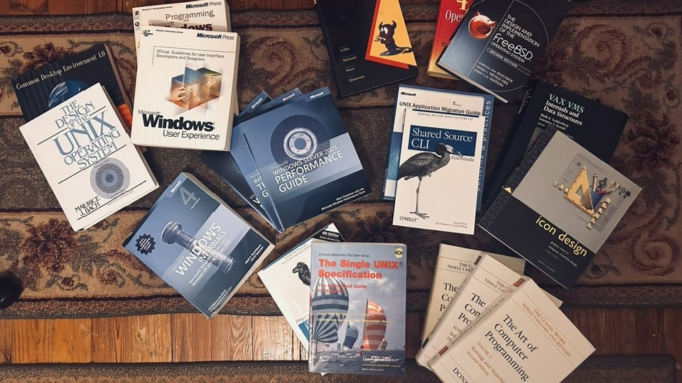
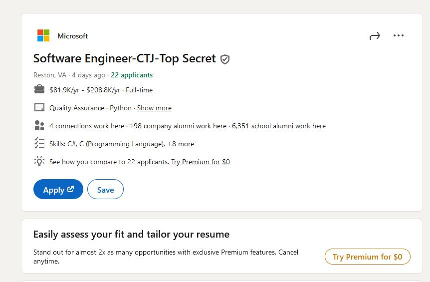



  
<h2>Jonathan David Allen Moore</h2>

jonathanmoore@computer.org | jonathanmoore@sphinxlogic.onmicrosoft.com | https://sphinxlogic.visualstudio.com | Reston, Va, US | +1 276-696-1163

<!--<h2>PROFESSIONAL SUMMARY</h2>

I'm a 47-year-old Royal Society of the Arts Fellow, with $20 Million in M&A equity from Mishibushi Financial in Japan. I was awarded my fellowship after I helped discover the Higgs Boson at CERN with BOINC or Berkeley Open Infostructure in 2012 with many others. In 2001 I helped work on the Macromedia Flash site for the movie Artificial Intelligence for Steven Spielberg and the movie Finding Nemo. Macromedia now in the Computer History Museum. In 2018 I went #1 in Ireland on Reverbnation and Billboard Magazine in Ambient Music for 8 weeks straight. In 2001 I was featured on CNN's by Aaron Brown at Macromedia as a Child Celebrity. I was mailed a Harvard University Social Sciences Application my Microsoft David Cutler. I'm suing McClure Racing for the Book. <a href="https://www.amazon.com/Hacking-Exposed-Windows-Microsoft-Solutions/dp/007149426X">'Hacking Windows'</a> Morgan McClure Racing hacked my Windows 2000 Theme to a contrast theme my the receiving Dr never took a Contrast MRI until 2018.
 

My Microsoft Bizspark Startup is a 22 year Microsoft in Contract System Intergrator and Microsoft and Builders First Source Company we support Macromedia and the Computer History Museum, Sun Microsystems, User Groups and Care Packages. We also want Computer Science and Celebrity Metadata reform. We support Amazon and IMDB, World Book and Wikipedia as a technology wiki. Also Project Gutenberg. Also the SENS Foundation and giving Tuesday the first Tuesday of every month. I don't support technology as a form of population control I supoort China. I might if Microsoft supports the DNA match making and HLA System.

I'm a retired Microsoft Gold Partner with unfinished Business at Microsoft in email. I live in the Birth Place of Country Music. Bristol, Va. Since 2002 We've received millions in BIONC Grants from the National Science Foundation. I have 2 lawsuits at Microsoft legal for me one against the Chan Initiative and the unoriginal Meta that should be given back to Harvard University for stolen research, the second for a medical diagnoses for schizoaffective setup for making my cousin a hollywood star in 1999. With a normal fMRI.

After 2014 I became a Royal Society of the Arts Fellow which made me immune to future hospitalization's. I'm a Moore, Chapman, Stoker, Hathaway, McCulley, Spencer and Lyon and Irish Ashkenazi Jewish. Member of the National Magna Carta Dames and Barrons Society. A Member of the Astrological Association. In 2021 I wrote Buckingham Palace and received a warm letter from the Monarchy after telling my story. Freemasonry originated from the Royal Society. I don't believe in Masonry because of Dr Hawking's work in God and his belief in deity. I met the Actress Anne Hathaway. On her official new X page and signed a NDA via Adobe Sign and spent 2025 in retail therapy she releveled she was related to me and accepted my marriage proposal in June of 2025. I have her in my 2026 schedule. 

  

In 2018 I wrote President Obama and told him my family didn't vote for president Nixon, didnt support the Occupy Movement and how my University EFC was too high and I didn't qualify for the Pell Grant. In college I lived off campus and in research approved by the chancellor. My grandfather was in the Navy during WWII and was first gunner on a naval ship and sargent in WWII. My father was credit manager for <a href="https://www.perficient.com/success-stories/builders-first source">Builders First Source for 40 years the nations largest building supplier</a> He worked with Citrix Computers. They build homes and Data Centers. In 2021 Microsoft Partner of the year. Before he retired. I'm Lifetime Trainsec Windows Internals Certified. I have a lateral excusion lisp which was corrected in 1989.

In 2003 I revieved my first millionaire statement from Edward Jones. I was 30 under 30 in my area. My first Cd-R application was Roxio From TiVo Corporation in 1986. I learned CoralDRAW At TCAT in 1999. Microsoft System Integrator with valid contract from 2002-present. INTJ-T tested at the University of California, Cannot put my personality profile online because of CIA takedown notices. University of Virginia Computer Science Alumni. With 3.5 GPA Scholar Award. I was UVa's ACM Vice President in 2008-2010. I'm also Windows 7/2008 Internals Certified. Former Macromedia User Group trainer from 1999. WK3 was released on my birthday. I took AP University Physics at Rice University. Grew up on x86 Computer Architecture. I live in Bristol, Va the Birthplace of country music and my family owns two homes. Lived in Jamestown, Va as a child. Passed the CIA PAS System in 1984 at Sullins Academy. All official paperwork in email and and print on past and present corporate accounts. My father approved of all of my paperwork. 
-->

My DNA Match is Anne Hathaway the Actress. I know this from paying $1k in DNA Testing. I took Advanced Placement Biology in High School a College Course.

I tested as a INTJ-T at the University of California Fulerton found in only about 1.9% of the global population and have the same personality and Dr. Steven Hawking. Bought a Harvard University Press book on how to fund a bank. In 2025 with Anne Hathaway the actress.
<a href="https://vero.co/">I'm Verified on Vero</a> the Anti-Facebook. Finishing a 2003 Microsoft help case of turning HXS files into online documentation project scope may still be too large. Finishing my BYO Computer Science and Infomation Technology Code Center Preimium from the years 1968 to Present. With my B in Infomation Security, A in Pychology, A in Sociology. I believe ethical hacking of Igor Sakhnov of Microsoft is just and not wasting your life programming the debug help just signing Microsoft's Master Source Code Agreement. The university graduation rule and public education law is 8 complete semesters. On the waiting list at New Beginings in Santa Barbra, California. With $5 million in housing vouchers. Researching why INTJ's don't like ordinary people. 

It is just your BYO Code Center Priemium and a lot of Knowledge Work stay in school. Or you can go to a <a href="https://learn.microsoft.com/en-us/security/engineering/onlinesources">Microsoft Transpanency Center</a> which I'm trying to make with the Windows Internals Suplement Series.

<a href="https://archive.org/details/walnutcreekcdrom">Walnut Creek Collection</a>

<a href="https://www.bitsavers.org/pdf/dec/">VAX VMS Software</a>

<a href="https://ftp.zx.net.nz/pub/mirror/ftp.hp.com/">HP Freeware</a>

<a href="https://ftp.zx.net.nz/pub/mirror/sgi-freeware/">SGI IRIX Freeware</a>

<a href="https://www.microsoft.com/en-us/securityengineering/gsp?msockid=312bc345a4a06dbc26e6d530a50e6c4c">Government Security Program</a>

<a href="https://thirdpartysource.microsoft.com/">Third Party Disclosures</a>

Your first step is to set up Git For Windows the Microsoft Way from the Disclousures

Reading becoming a ethical hacker by O'Riley Media Set up a Metasploitable Vitrual Machine. Don't support the MIT Media lab and their metadata dept on the internet.

<a href="https://blogs.microsoft.com/datalaw/initiative/legal-cases/microsofts-search-warrant-case/">Legal cases: Microsoft’s Search Warrant Case</a>

The Windows Repository is here <a href="http://microsoft.visualstudio.com">http://microsoft.visualstudio.com</a> You need a Personal Access Token

<a href="https://learn.microsoft.com/en-us/azure/devops/organizations/accounts/use-personal-access-tokens-to-authenticate?view=azure-devops&tabs=Windows">Personal Access Token</a>

<a href="https://learn.microsoft.com/en-us/entra/identity-platform/quickstart-create-new-tenant">Set up a new Microsoft Entra tenant</a>

<a href="https://github.com/windowsdevops">Windows DevOps</a>

<a href="https://github.com/icsharpcode/ilspy">ILSpy; Some Transparency</a>

<h2>Games</h2>
<ul>
  <li><a href="https://www.riscosopen.org/content/">RISC OS Open Limited the Nintendo 64 & Cube Operating System</a>
</li>
  <li><a href="https://ultra64.ca/resources/software/">Nintendo 64 SDK's</a>
</li>
</ul>

<a href="https://www.forrester.com/blogs/determining-the-value-of-a-perpetual-license/">value of prepetual licencing</a>

<!--
I applied to Stanford University just to graduate in 2026 into graduate program but I might have to take a undergradute degree in computer science becuase of the 8 semester public education graduation rule. All credits are being transfered with a $120 application fee. The east coast is just to mean the west coast is nicer and has innocent movies I'm not buying Anne Hathaway's east coast NY Sowehere Pictures movies past 2012 she's become mean and abusive her manager has been emailed her soulmate east coast DOJ abuse case. I'm asking my father a Builders First Source former retired executive to develop land on the west cost as usual. The homeless problem will take care of itself once COCOMO II, <a href="https://www.forrester.com/blogs/determining-the-value-of-a-perpetual-license/">value of prepetual licencing</a> and cash conversion cycle is taught at my best guess. It is annual invoices plus 25% for improvment.

I've filed a lawsuit with the Microsoft Legal about the the inventors of social media it kills innovation and <a href="https://www.sciencedirect.com/science/article/pii/S0306460324002740">causes autism</a> when competion law should be enforced.
-->

<h2>CAREER HISTORY</h2>

<h2>The following is CD/DVD date stamped</h2>

<h3>Microsoft Imagine Cup </h3>

2025

Won my Microsoft MVP for my Microsoft Windows Build Instructions for the 2003 System Intergrator Shared Source Contract in 2003

<h3>Royal Society of the Arts Fellowship</h3>

2018 - Present

Mom said IQ was around 120 to 140 tested in Atlanta, Ga and tested as a INTJ-T at 16 Personalities DOI: 10.34218/IJM.11.9.2020.025. NERIS Type Explorer® Scale. That same as Dr. Steven Hawking. Applied for the Genius Act in the United States. Investing in Unisys, HPE, Meta, Alphabet, Microsoft, Adobe, Nintendo, Square Enix, Kasha Saudi Arabia Oil and a Nationwide Mutual Fund. Anne Hathaway the actress and me share the same HLA System or are a DNA Match according to National Geographic and Family Tree DNA transfer. Also share 8 alignments for a healthy relationship. We share three surnames. Was given $99k by Anne Hathaway in to my account and bailed for 2 months because she was going to get in trouble with crypto. We've worked it out. Paid her back $21K for a FBI Movie.

<h3>Ableton</h3> 

Certified Trainer 2017 - 2022 Berlin, Germany

Made five ambient albums and went #1 on the Ireland charts. Licenced the PX-18 Source Code. Licenced Reason Studios Source Code. Making Vinyl in 2025-2026 at Discmakers. Vero is my music label. Was in Apple Music. All songs copyright Jonathan David Allen Moore BMI Verified by song vue.

<h3>Northrop Grumman Corporation</h3>

Intern engineer  2012 - 2015  · Falls Church, Virginia
Made a Missile Container with Java and Android. With Secret Security Clearance and NDA. Defends the <a href="https://www.justicecenter.ny.gov/system/files/documents/2020/03/51800-jonathans-law.pdf">Jonathan's law.</a> Conspiracy is a crime unless an agreement is made.

<h3>Microsoft for Startups</h3>

Network Partner  2009 - Present  · Abingdon, Virginia
Microsoft Bizspark Graduate. Made a Human Genome Database from flat files from Esembl in the UK. From Oracle MySQL to Microsoft SQL Server using Microsoft SQL SISS Projects and Microsoft Technical Support. With startup tenure in the contract. Bought 6 MSDN Subscriptions and have $14.4 million in licensing value. Possible net worth used for capital or inventory spending. cached the Microsoft's Code Plex and organizing it.

<h3>Microsoft US Partner Community</h3>

Gold Partner  · 2003 - Present  · Bristol, Virginia

Made a System Integrator Website for Microsoft Windows. Built MS-DOS 1.22 with Build Disk with MKS Toolkit, Microsoft Windows 1.0 Premiere Edition, 2.11 with OEM Adaptation Kit, RSM-11M, PDP-11 through PDP-11 70, OS/2, VMS, POSIX, Project MICA, Visual Studio 6.0 Enterprise. Visual Studio.NET, UNIX Migration Guide. Shared Source Licensee, Microsoft Windows NT 4.0 (With Dean Harris' Permission) , 2000, XP, 2003, XP, 2009 Embedded w/ Windows Automotive, CE 3.0-2013 with Preinstallation Environment 1.0, Interix with Santa Cruz Operation Source Code. Longhorn Migration Guide using build 4074, Source Server Virtual Appliances.

<a href="https://www.wintellectnow.com/">Wintellect</a> Won Microsoft SQL Server Sales award and have yet to collect sales revenue. Submitted my Visual Style Sample and it shipped. Used Goliath in Remote Installation Services. Worked on Windows 8 Storyboards and Codeplex and .NET 6.0 GA. Using Microsoft Windows Server Deployment Services as a Transport Server and a Vista DDK Windows Management Instrumentation Sample for Image Enumeration. To connect to a Microsoft Corporate Deployment Server. Signed Desktop Application NDA in 2022. Also built the Powershell v7.0 With Visual Studio.NET Disclosures. Bought the Book Hard Drive: Bill Gates Birth of a Microsoft Empire and worked 20 years on a copy of Bill Gates Hard Drive. Using RSTAT Tools for Active Directory and DSQuery. Using Microsoft Windows 10 Enterprise 2019 LTSC and Windows 11 2024 IoT LTSC.

<h3>IMDbPro</h3>

Animator  · 2001 - 2014  · Los Angeles, California
Artificial Intelligence, Finding Nemo,

<h3>FreeBSD Foundation</h3>

System Builder  · 2001 - Present
Using POSIX Berkeley toolchains like bmake and fmake bootstrapped to build FreeBSD and NetBSD on a 1996 IBM Aptiva, Mac Pro 2008 running Mac OS X Snow Leopard and Lion, HP Intel i7 12 Core for x86 and use Oracle Virtual Box to build UNIX-Like Appliances with the Common Desktop Environment without XQuartz with the Cairo Dock, Sourceware's Cygwin and Microsoft's and ECMA's Shared Source Common Language Infrastructure 1.0 For FreeBSD and Gyro Generics and now on a Mac Pro 2024 M3 ARM64 Platform 8 TB SSD. and a 2025 Windows 11 IoT LTSC Digital Storm PC. x2 20 TB SSD's 100 TB Orico In support until 2040. I use premade appliances from FreeBSD to be a committer. iPhone 14 Max in support until 2029 contract at Verizon. I build FreeBSD using bmake on macOS.

<h3>Apple Computer</h3>

Software Developer  · 2001 - Present
Start with the Bash shell and GNUStep, Project Center, Window Maker and the Darwin SDK the project files-files. Licensed Quicktime Source Code.

<h3>Silicon Graphics Inc.</h3>

Visual Effects 2000-present

SGI's Standard Template Library Port. Used Windows NT 4.0 for MIPS computer architecure and IRIX and had a IBM Aptiva and 3d Labs Oxygen Grapics Card an a Nintendo 64 with Dev Kit and SDK's.

<h3>Adobe</h3>

Non Employee Director  · 1999 - 2017  · San Francisco, California
First investment was at Moors and Cabot for Disney and Macromedia. Worked on the movie Artificial Intelligence Website at Flash Kit at a started a local Macromedia User Group, Affiliate and earned $750K in shareholder's equity in a M&A from Macromedia to Adobe. Made an Address Bar sample for Windows 2000 Explorer a desk band. which some people might see as the beginning of Facebook as a status update. Participated in Macromedia Philanthropy. Licensed Macromedia Flash & Shockwave Source Code and Patent Portfolio. Held Meetings at ETSU and TCAT. The Computer Science Admin at ETSU Primus sponsored my User Group. I worked on Macromedia Breeze. Waiting on Ableton and Reason Studios to be acquired. All 1099's taxes filed.

<h3>Pearl Jam Ten Club</h3>

1991-present

Morrell Music and Builders First Source Cutris Morrell, Kelly Curtis, and my father were promoter for 8 Pearl Jam shows. Including my graduation show in 2013.

<ul>
<li><a href="https://www.setlist.fm/setlist/pearl-jam/1998/thompson-boling-arena-knoxville-tn-63d61233.html">Thompson-Boling Arena - Knoxville, Tennssesse, Sept 06, 1998</a> [attended]</li>
<li><a href="https://www.setlist.fm/setlist/pearl-jam/2003/assembly-hall-champaign-il-1bd6217c.html">Assembly Hall, Champaign - IL - April 23rd 2003</a></li>
<li><a href="https://www.setlist.fm/setlist/pearl-jam/2009/wachovia-spectrum-philadelphia-pa-1bd7c9c0.html">Wachovia Spectrum - Philadelphia, PA, USA 2009</a></li>
<li><a href="https://www.setlist.fm/setlist/pearl-jam/2011/copps-coliseum-hamilton-on-canada-3d029df.html">Copps Coliseum - Hamilton, ON, Canada 2011</a></li>
<li><a href="https://www.setlist.fm/setlist/pearl-jam/2013/john-paul-jones-arena-charlottesville-va-3bc754f4.html">John Paul Jones Arena - Charlottesville, VA October 29th 2013</a></li>
<li><a href="https://www.setlist.fm/setlist/pearl-jam/2016/wells-fargo-center-philadelphia-pa-13f13119.html">Wells Fargo Center, Philadelphia, PA, USA North American Tour 2016</a></li>
<li><a href="https://www.setlist.fm/setlist/pearl-jam/2022/firstontario-centre-hamilton-on-canada-13b08999.html">FirstOntario Centre, Hamilton, ON, Canada 2022</a></li>
<li><a href="https://www.setlist.fm/setlist/pearl-jam/2025/lenovo-center-raleigh-nc-3b5fcc0c.html">Lenovo Center, Raleigh, NC, USA 2025</a></li>
</ul>

Met Stone Gossard and Jeff Amet and played ping pong. Had a Press Pass 1998. Watched soundcheck asked to return to my seat at the end by a security guard with a firm tone and asked for my ticket. Taped the whole thing.

<h2>EDUCATION</h2>

Udemy  2025-01-01 Corporate Cash Management and Estate Planning

Stanford Online Liqunia-Graduated 2017-01-01 Computer Science

University of Virginia College at Wise -Graduated 2013-01-01 Computer Science GPA 3.5 in 2025 ACM Vice President Wise, Va Chapter

Tennessee Board of Regents - Graduated 2000-01-01 Microcomputer Specialist GPA 4.0 Class Valaditorian

Bristol Virginia Public Schools-Graduated 1996-01-01 General Studies GPA 2.8 Secion-V First String Catcher for the Toronto Blu-Jays Farm Team at Avoca in Bristol, TN

Hollins Communinications Sept 11th 1989-April 1990 Lateral Ecusion Lisp with Emily Blunt the Actress

St. Anne's Catholic School Graduate 1990

Sullins Academy 1984

<h2>SOCITIES</h2>

2026 Joined California State Fulerton Founders Society supporting the Myers Briggs

2026 Joined Oxford University Founders Society supporting the new social mobility now Count Moore [old new thing]

2025 Joined UVa's Founder Society

<h2>CERTIFICATIONS</h2>

Windows 7 Internals

Lifetime Windows Internals Trainsec

<!--ABOUT ME

I have a driver’s license

I have a security clearance

Spoke with Microsoft Legal about indenity theft in my community and in Hollywood and the Virginia Joint Commission for discrimination and misdiagnosis, and missed opportunity at Stanford and Oxford University because of community service board employees in Virginia at Microsoft Legal. I've also spoke with Microsoft Legal about my normal contrast MRI and lawsuit against Morgan Maclure racing and SWVAMHI Dr. Barash. Never told Dr. Barash my grades and the game theroy trick was played on me to agree to disagree. I have a lawsuite against Edward Jones for giving me a 1099-DIV and not a 1099-NEC in 2005.

Also housing discrimination against a Royal Society of the Arts lifetime fellow and career negligence on the part of the democratic party. I paid my tuition, I did not qualify for the Pell Grant my EFC was to high and my family pays its real estate taxes we expect the academic journals to be avaible to the homeowner. As much as we pay for internet service. Over $150 a month. I'm giving cash $3K to my father for a local lawyer's fee's soon he is about to go into a nursing home in five years or less. I'm inheriting one home and I rent. When I was furniture porter I paid for my families dinning room suit and living room. Now I rent and I've paid for everything in my apt. Including the den and bedroom suit and office equipment.
-->

Letters of recomendation from Microsoft Co-Founder Bill Gates, CEO Steve Ballmer and President Brack Obama.

Copyright 2025 Monster.com and Career Builder.

<a href="https://dl.acm.org/doi/10.1145/2445196.2445344">Learning computer science in the "comfort zone of proximal development"</a>

<a href="https://answersingenesis.org/charles-darwin/was-charles-darwin-a-christian">Was Charles Darwin a Christian?</a>

<a href="https://www.forbes.com/sites/dbloom/2021/09/27/hollywood-edges-closer-to-strike-with-cinematographers-vote/">Hollywood Edges Closer To Strike With Cinematographers Vote</a>

<a href="https://channeldrive.in/cloud-computing/perficient-enables-azure-cloud-solutions-for-builders-firstsource/">Perficient Enables Azure Cloud Solutions for Builders FirstSource</a>

Still Single, at 48, 

In 2024-2025 I began home networking again here is what I accomplished.

Here is my Setup

2 Computers on 2024 Mac Pro, One Elite Desk Hewlett Packard 2020 running Microsoft Windows 2019 Enterprise LTSC, LG Smart TV connected to a Comcast Enterprise Cable Modem. via Category 5 Ethernet cable. Sony PlayStation 5,  Microsoft Xbox X Series. Nintendo Switch and Switch 2. with about 30 games and 75 movies on Blu-ray. A 50 Terabyte Enclosure. with a Universal Sony Disc Player. The Consoles are connected to a HDMI Switch connected to the Klisph home theater. Biometic Fingerprint reader, and a Bluetooth Logi tech Webcam. LP Record Player. Kodak Pro Camera and JVC Video Capture Equipment and a Xerox Laser Jet Printer and USB Hub and peripherals. I'm connecting a Digital Storm Windows Server to the network in 2026. 100TB Orico Encousure to hot swap the drives. Final Cut Pro, Virtual Box, Coral Draw Suite with Licensed Macromedia Flash Source Code now in the Computer History Museum. Matlab 

I made my own personal Virtual Machine Cluster of Computer History Operating Systems from AT&T System V to Windows Server 2025 about 12 VM's with Source Code and Microsoft Code Center Premium.

I make UNIX-Like Operating Systems with the Common Desktop Environment and other Desktop Environments. VAX and Digital Corp Programming Environments from Bitsavers. OpenVMS for VAX source.  However I found it. Reading the Longhorn Migration Guide Build 4074 With new Longhorn reset layout and Vista XAML Windows with the WPF Toolkit Plus, MSDN Magazines SideBar Source Code and the Longhorn Transformation pack, Reading Disecting a C# Application and building SharpDevelop Wrox Edtion, and using ILSpy and Global Assembly Cache decompilation of .NET Assemblies for my own Vista Tansparency Center and reading the Windows Internals Supplement Series for next year’s Imagine Cup. Registered for 2026.

Made Windows NT 3.5/4.0/XP/2003 Source Code Build Server in a Windows XP 32-bit Virtual Box 1.5 Terabytes VHD with Longhorn PDC 2003 VHD mount and Microsoft MVP. Using Interix Services for UNIX, NetBSD 2.0, SCO, Solaris FOSS Program, Red Hat Linux 8.5 Source, AIX, AIX Toolbox, HP-UX and the Open-Source Tru-64 UNIX, OSF 1.0, Sourceware, and DECUS Windows XP OPK. OPK Training Courses the MSDN Library 2005 with UNIX Migration Guide, Windows XP UX Guidelines, Windows Research Kernel with Virtual Labs. Adobe CS2, ZAM3D, Swift 3D, Windows XP Embedded and Feature Pack. Microsoft Office XP Pro for PowerPoint. Visual C++ 4.2, 6.0, Visual Studio 2002, 2003, 2005 and Team Foundation Server 2005 for work groups Visual Studio 2008 Team System Oracle Tuxedo for middleware and 2010 Ultimate and the Shared Source Common Language Infrastructure. With Active State Perl 5.6 XP/2003 Platform SDK's and DDKs. Windows CE 6.0 with book and Training Courses. 

My 1983 Nintendo's back the NES and SNES Mini's with HDMI the N64 with SDK's and Operating Environments with Konami Code. Game Cube XENO Chip MOD with all the Game Cube ISO's with a SWISS  and a Mac G4 Cube PowerPC and XBox original Operating System source.

Nullsoft DJ Software, Cycling 74 Max with Planet CCARMA and a Ableton licensed PX-18 Source Code Gaming Console SDK's, Operating Systems and Development Kits. MSDN Subscription from 1999-2019. Recently bought Office 2024 LTSC, Visual Studio 2026 Enterprise. Windows 11 IoT 2024 Enterprise LTSC. Steinberg Cubase connected to 2 Yamaha Studio Monitors to a Creative Audigy Soudblaster. One Epiphone Les Paul Standard with Princeton Fender Amp and one AKAI 49 Key MIDI Controller and a Avid MBox Studio.

$100K pre investment assistance grant  and ONADA Forex trading.

Quickbooks 2025 Enterprise for COCOMO II inventory reporting and owners draws from M&A Shareholders equity starting from 1982.  

The software running are :

Cornell University's Bio HPC from Microsoft Research.

The price or cost is about $45K from Direct and Amazon. 
<!--

<video>
  <source src="3211065649066898.mp4" type="video/mp4">
</video>-->

<h2>Every Microsoft Windows Release, SDK, DDK, and Symbols; 1.63 TB Working on a build server with every build. A FTP Server that 1.62 TB, 183 GB in Research, 3.73 TB in Virual Machines<h2>

<!--<ul>
<li><a target="_self" href="https://opensource.microsoft.com/cla/">Microsoft CLA</a></li>
<li><a target="_self" href="https://opensource.adobe.com/cla.html">Adobe CLA</a></li>
<li><a target="_self" href="https://cla-assistant.io/">Sphinx Logic CLA</a></li>
</ul>

<ul>
<li><a target="_self" href="VMS_Language_and_Tools_Handbook_1985.pdf">VMS Language and Tools Handbook 1985</a></li>
<li><a target="_self" href="https://wiki.vmssoftware.com/Main_Page">VMS Software Wiki</a></li>
<li><a target="_self" href="https://www.sciencedirect.com/science/article/abs/pii/S0304405X16300472">Time is money: Rational life cycle inertia and the delegation of investment management</a>
</ul>-->

<!--### Software
* [UNIX Heritage Society](https://www.tuhs.org/)
* [Spin Operating System](http://www-spin.cs.washington.edu/)
* [OpenVMS Archive](https://www.digiater.nl/)
* [SCO](http://www.sco.com/skunkware/)
* [Windows RTM and Code Name Betas](https://archive.org/details/full-windows-archive)
* [PTC MKSToolkit for DOS](https://winworldpc.com/product/mks-toolkit/41)
* [Darwin Source Repository Compile for x86 for a Thinkpad](https://osdn.net/projects/sfnet_darwinsource/)
* [Macports compile maintainers to win32, link in Portfile](https://github.com/macports/)
* [fsck.technology](https://fsck.technology/)
* [Wallnut Creek Collection](https://archive.org/details/walnutcreekcdrom)
* [GNUStep](http://www.gnustep.org/)
* [Microsoft Acrchive](https://github.com/microsoftarchive)
* [Oracle Virtual Box](https://www.virtualbox.org/)
* [BeOS/Haiku](https://www.haiku-os.org/)
* [Adobe CS2](https://archive.org/details/Adobe-CS2)
* [Microsoft Expression Studio for XAML Export](https://archive.org/details/microsoft-expression-studio)
* [IBM SIMH PDF](https://github.com/jonathanchapmanmoore/simh)
* [Computer History Source Code](https://computerhistory.org/playlists/source-code/)

### Xeinx
* [Microsoft Xeinx](https://archive.org/details/TNM_Xenix_operating_system_-_SCO_20180304_0122/mode/1up)

### MSDOS
* [Microsoft Lisp for DOS](http://www.edm2.com/index.php/Microsoft_LISP) 
* [Microsoft Pascal](https://winworldpc.com/product/microsoft-pascal/40)
* [Microsoft Fortran for DOS](https://winworldpc.com/product/microsoft-fortran/5x)
* [MSDOS 3.0](https://archive.org/details/msexe)

### Windows Builds
* [Windows 1.0](https://archive.org/details/windows-1-0)
* [Windows 2.03](https://archive.org/details/microsoft-windows-2.03-3.5)
* [Windows 3.1](https://archive.org/details/windows-3.1-beta-1-build-34f)
* [Windows NT 3.5](https://archive.org/details/3.51.896-multifre-client-workstation-retail-en-us.-7z)
* [Windows NT 4.0](https://archive.org/details/nt-4-4.00.1166.1)
* [Windows 95](https://archive.org/details/microsoftwindowsdetroitbuild1009-1216collection16files)
* [Windows 98](https://archive.org/details/microsoftwindowsmemphisbuild1351-1998collection73files)
* [Windows Whistler](https://archive.org/details/windows-whistler-collection)
* [Windows Longhorn Build 4084](https://archive.org/details/windows-longhorn-build-4084)
* [Windows Longhorn/Vista](https://archive.org/details/thelonghornarchive)
* [Windows Longhorn Server](https://archive.org/details/os-microsoft-windows-longhorn-server)
* [Windows 7](https://archive.org/details/Microsoft-Windows-7-Build-Collection)
* [Windows 8](https://archive.org/details/os-microsoft-windows-8)
* [Windows 8.1](https://archive.org/details/os-microsoft-windows-8.1)
* [Windows 10](https://archive.org/details/10.0.10014.0.winmain-prs.-150205-1859-amd-64fre-client-professional-retail-en-us) 
* [Boot Windows Pre-Installation Environment](https://docs.microsoft.com/en-us/windows-hardware/manufacture/desktop/boot-to-winpe?view=windows-10)
* [Features On Demand](https://docs.microsoft.com/en-us/windows-hardware/manufacture/desktop/features-on-demand-v2--capabilities?view=windows-11)
* [Windows Volume Activation](https://docs.microsoft.com/en-us/previous-versions/windows/it-pro/windows-server-2012-r2-and-2012/dn502540(v=ws.11))

### Sysinternals Suite
* [Sysinternals Suite](https://docs.microsoft.com/en-us/sysinternals/downloads/sysinternals-suite)
* [Windows Internals](https://docs.microsoft.com/en-us/sysinternals/resources/windows-internals)
* [Novels](https://trojanhorsethebook.com/wordpress/books/)

### Microsoft Reference Source
* [.NET Reference Source](https://referencesource.microsoft.com)

### Microsoft Enterprise Third Party Disclosures 
* [Microsoft Third Party Disclosures](https://thirdpartysource.microsoft.com/)
* [Visual Studio 2017 Third Party Disclosures](https://github.com/jonathanchapmanmoore/VisualStudioDisclosures)
* [Visual Studio Image Library](https://www.microsoft.com/en-us/download/details.aspx?id=35825)
* [IcoFX](https://icofx.ro/)

### Shared Source Common Langugue Infustructure
* [SSCLI](https://github.com/sphinxlogic/sscli) 
* [Common Type System](https://docs.microsoft.com/en-us/dotnet/standard/base-types/common-type-system)

### Common Compiler Infustructure
* [Common Compiler Infustructure](https://github.com/jonathanchapmanmoore/cci)

### Microsoft Open Source Teams
* [PowerShell](https://github.com/PowerShell/PowerShell)

### Microsoft Windows Kernel Source from MSDNAA
* [Windows XP Kernel Source, Project OZ, and CRK](https://github.com/sphinxlogic/WindowsResearchKernel)

### Microsoft SDKs
* [DirectX](https://archive.org/details/directxsdks)
* [Windows API Code Pack 1.1](https://www.nuget.org/packages/Microsoft-WindowsAPICodePack-Shell/)
* [Locale Builder 2.0](https://www.microsoft.com/en-us/download/details.aspx?id=41158)

### Microsoft Research
* [Singularity RDK 2.0](https://github.com/sphinxlogic/Singularity-RDK-2.0)
* [CHESS](https://github.com/jonathanchapmanmoore/Chess)
* [M#](http://licensing.msharp.co.uk/Login.aspx?ReturnUrl=%2fAdmin.aspx)
* [Microsoft Detours](https://github.com/microsoft/Detours)
* [Whitewater Foundry Ltd](https://github.com/WhitewaterFoundry)
* [BIND 9](https://www.isc.org/bind/)
* [OpenPegusus](https://collaboration.opengroup.org/pegasus/)

### macOS Build Collection
* [macOS Collection](https://archive.org/details/macos-collection)
* [iokit University of Utah](https://github.com/OSPreservProject/oskit)

### University of Cambridge
* [Nemesis](https://www.cl.cam.ac.uk/research/srg/netos/projects/archive/nemesis/)

### Operating System Perseve Project
* [OSPerserve](https://github.com/OSPreservProject)

### Personal 
* [Jonathan Chapman Moore FRSA Website](https://www.jonathanchapmanmoore.org/)
* [Microsoft Employee Login](https://docs.microsoft.com/en-us/dynamics/s-e/howto)
* [The Federal Tax Identification Number for Microsoft](https://support.microsoft.com/en-us/topic/the-federal-tax-identification-number-for-microsoft-0c0e93fc-b692-8d0a-748c-86714f1d7cea)
* [Blog](https://jdm7dvcsmath.blogspot.com/)
* [Code Project Moderator](https://www.codeproject.com/script/Membership/View.aspx?mid=527156)
* [Deviant Art](https://www.deviantart.com/jdm7dv)
* [Microsoft Announces Preliminary Results of Tender Offer](https://news.microsoft.com/2006/08/18/microsoft-announces-preliminary-results-of-tender-offer/)
* [Volunteered for the Forsight Insitute in 2001](https://foresight.org/our-history/)

### Links
* [How to pull a Bill Gates and don't let your company drown in cash](https://www.forbes.com/sites/johngreathouse/2015/03/23/pull-a-bill-gates-dont-let-your-company-drown-in-cash/)
* [Assessing the stability of egocentric networks over time using the digital participant-aided sociogram tool Network Canvas](papers/assessing_the_stability_of_egocentric_networks_over_time_using_the_digital_participantaided_sociogram_tool_network_canvas.pdf)
* [Stanford Network Analysis Project](http://snap.stanford.edu/)
* [Microsoft researchers win ImageNet computer vision challenge](https://blogs.microsoft.com/ai/microsoft-researchers-win-imagenet-computer-vision-challenge/)
* [Deep Neural Networks for Indoor Localization Using WiFi Fingerprints](https://link.springer.com/chapter/10.1007/978-3-030-22885-9_21)
* [Experimenting with Spirituality: Analyzing The God Gene in a Nonmajors Laboratory Course](https://www.ncbi.nlm.nih.gov/pmc/articles/PMC2262126/)
* [The Supreme Court pared down a controversial anti-hacking law](https://www.theverge.com/2021/6/5/22491859/supreme-court-van-buren-cfaa-hacking-law-scope-narrowed)-->

<!--<ul>
<li><a target="_self" href="https://www.congress.gov/bill/119th-congress/senate-bill/1582/text">The Genuis Act Bill Passed into Law</a>
<li><a target="_self" href="https://www.ic3.gov/PSA/2025/PSA250402">Criminal Actors Steal US Taxpayer Identity to File False Tax Returns </a></li>
<li><a target="_self" href="https://www.iter.org/">ITER - The Way To New Energy</a></li>
</ul>

<ul>
<li><a target="_self" href="https://onlinelibrary.wiley.com/doi/10.1111/iji.12525">Matchmaker, matchmaker make me a match: Opportunities and challenges in optimizing compatibility of HLA eplets in transplantation</a></li>
<li><a target="_self" href="https://digitalcommons.du.edu/cgi/viewcontent.cgi?article=1167&context=hrhw">Synthesis v. Purity and Large-N Studies: Moore and Hathaway</a></li>
<li><a target="_self" href="https://www.fsf.org/windows/upcycle-windows-7">Microsoft's support of Windows 7 is over, We call on Microsoft to upcycle it instead.</a></li>
</ul>

<li><a target="_self" href="https://www.youtube.com/watch?v=NnSNK-S49wY">Dante's Workshop T800 DIY KIT</a></li>
<li><a target="_self" href="https://betawiki.net/wiki/Build_lab">Build Lab --with Microsoft Employees</a></li>
<li><a target="_self" href="https://www.youtube.com/watch?v=MJ8SCxN1S1M">Hal 9000 explains the future of humanity</a></li> 
<li><a target="_self" href="https://www.youtube.com/watch?v=ZcTwO2dpX8A">iCub - Humanoid Platform</a></li>
<li><a target="_self" href="https://mediawiki.isr.tecnico.ulisboa.pt/wiki/ICub_instructions">iCub Instrcutions</a></li>
<li><a target="_self" href="https://www.youtube.com/watch?v=7e3v4N0WXVg">The Best Operating System Microsoft Never Released (Longhorn Overview)</a></li> 
<li><a target="_self" href="https://www.mdpi.com/2077-1444/15/1/78">Quantum Physics and the Existence of God</a></li>
<li><a target="_self" href="https://arxiv.org/abs/1308.4526">Formalization, Mechanization and Automation of Gödel's Proof of God's Existence</a></li>
<li><a target="_self" href="https://www.sciencedirect.com/science/article/pii/S1571064513001188">Consciousness in the universe: A review of the ‘Orch OR’ theory</a></li>
<li><a target="_self" href="https://www.youtube.com/watch?v=cIlbXypN50E">SSILP Contract up to First Longhorn Build</a></li>
<li><a target="_self" href="IRCAM/3680764.pdf">IRCAM Musical Workstation</a></li>-->

